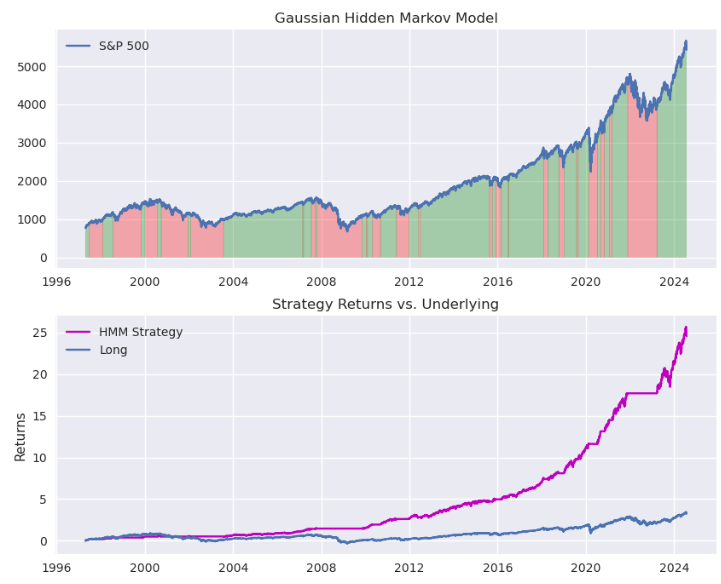
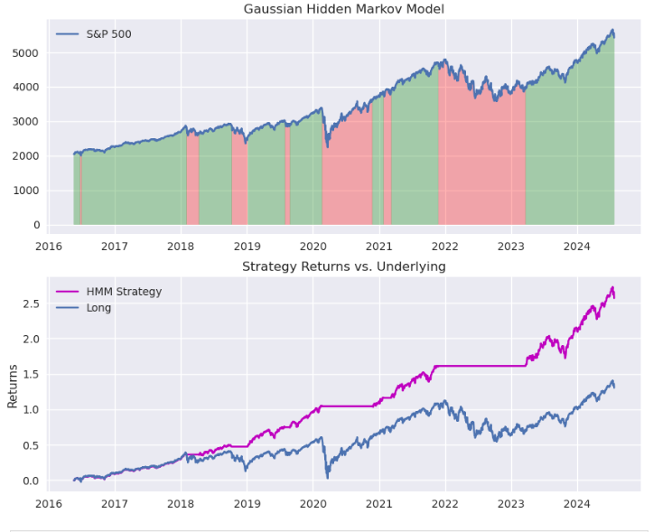

## Detecting Regime Change In Financial Markets Using Machine Learning
Preston Fisk

prestonfisk99@gmail.com

github.com/prestonf99

## Overview
In this repository, we implement a Gaussian Hidden Markov model to financial time series that generates binary predictions on future returns. The model's outputs are either 0 or 1, with 0 being an indication to the market participant to flatten positions, 1 being an indication to go long. The model pays attention to the returns of the index and the realized volatility of the index to make its predictions. There are two files in this repository, a notebook walking through the process (hidden_markov.ipynb) and a background script that processes data, performs calculations, and generates plots for the model. The general idea here is "what would happen if we built a model that assisted market participants in sidestepping drawdowns, and what would the returns look like". As seen below, before implementing a training/testing split, the model and its returns looked pretty great: 

### Implementing a Training & Testing Split
From experience, we've learned that a model's utility really isn't relevant at first glance. So we implemented a training and testing split to evaluate the performance of the model out of sample. We implemented a 70/30 training/testing split and were pleased with the results. 

### Data Provider
We're using the Yahoo Finance API to get our financial time series. For our purposes, we investigated the S&P 500, but this model can be applied to any ticker on the Yahoo Finance website. You can play around with this model on basically any U.S. equity with ease by changing the 'underlying' in the first cell.  
    
## Setting it Up

*Directions are in windows, chatgpt can be your friend here if on mac*

1. First, you'll need to install miniconda on your computer 
        
        https://docs.anaconda.com/free/miniconda/index.html

2. Open the Anaconda prompt (windows search 'miniconda') and install the packages (at this step you can look up how to create an environment, but if you're only using python to execute these files it really isn't a big deal if you just use the base environment). 

        pip install numpy pandas matplotlib yfinance jupyter hmmlearn

3. After the installations are done, open jupyter lab

        (base): C:\Users\your_computer> jupyter lab

4. Navigate to the folder that contains the files in the repository and ensure that the markov.py & hidden_markov.ipynb are in the same folder. 

5. Open hidden_markov.ipynb & hit shift+enter until all of the charts are loaded. Refer to the bottom of this file for troubleshooting tips. 

6. The hidden_markov.ipynb file will walk you through the exercise step-by-step; imports, calculations, model configuration, initial testing, scrutinizing the model, and more are all in that file.

**_Some issues we've ran in to_**

* At times, the model's output will be backwards (Long will be a 0, flat will be a 1), just re-run the model & it shouldn't be an issue.
* The `model = hmm.GaussianHMM(n_components=2, covariance_type='diag', n_iter=1000)`, where you set up the model, occasionally gives an error code, just navigate back to it and hit shift+enter again. 

**_Further Testing_**
* If you want to add another variable to the model, feel free to calculate it and add it. `model=hmm.GaussianHMM(n_components=3, covariance_type='diag', n_iter=1000)`. It is imperative that all three time series have the same start date & end date. 
* When adding another input, your fitting will look like: `model.fit(np.column_stack([data['Returns'], rvol, YOUR_ADDITION)`.
* Keep in mind that you're still looking to predict the returns so the `prediction = model.predict(np.column_stack([data['Returns']]))` will stay the same. 
    